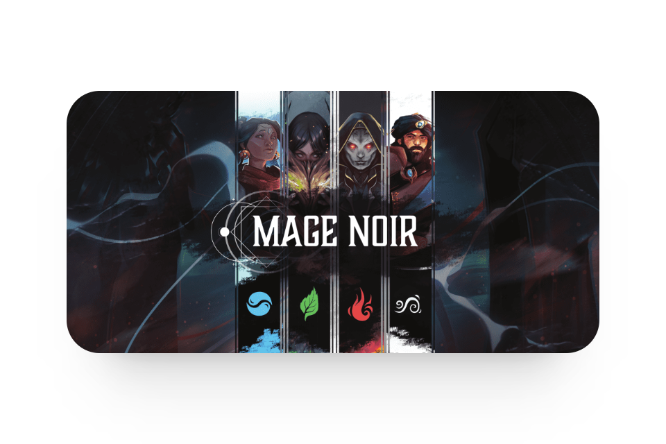

    
    
    
    

# Mage Noir spell scrapper

This is a Python script that uses data from the [Mage Noir public card database](https://magenoir.com/collection.html) to create an [Obsidian](https://obsidian.md/) vault with that information.
